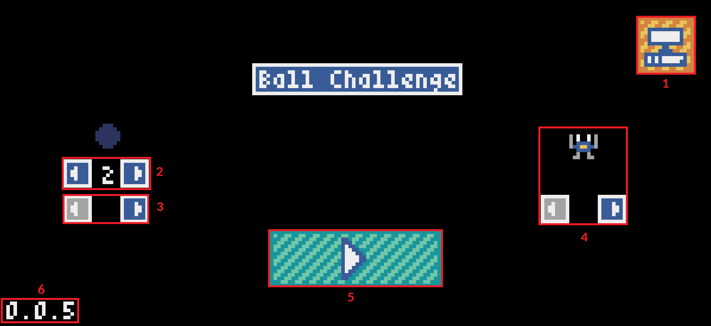
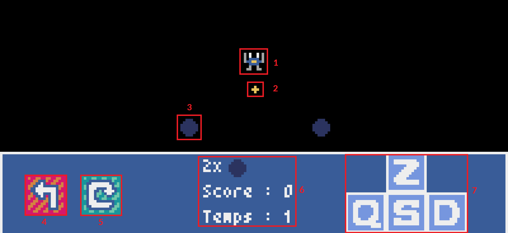

# Jouer

[Clique ici](https://osiris-sio.github.io/HTML_Ball-Challenge/) pour jouer sur le navigateur, que tu sois sur PC ou Smartphone !

# Description 

Plongez dans l'action avec _Ball Challenge_, un jeu d'arcade addictif où votre agilité est mise à l'épreuve ! Évitez habilement les balles rebondissantes tout en collectant autant de pièces que possible. Affrontez vos propres records et défiez vos amis pour voir qui peut atteindre le plus haut score !

# Caractéristiques

 

* Esquivez les balles: Utilisez votre réflexe et votre rapidité pour éviter les balles qui rebondissent sur les murs.
* Collectez des pièces: Ramassez le plus de pièces pour accumuler des points.
* Défiez-vous: Testez vos compétences en tentant d'obtenir le meilleur score possible dans ce jeu rapide et stimulant.
* Graphismes rétro: Plongez dans une esthétique rétro avec des visuels charmants.
* Facile à jouer, difficile à maîtriser: Accessible à tous, mais assez difficile pour défier même les joueurs les plus expérimentés.

# Menu

1. Changer la couleur de la balle (15 couleurs)
2. Changer le personnage (8 personnages)
3. Changer la plateforme. Permet de désactiver l'affichage de la souris et de prendre en charge le tactile.
4. Bouton pour lancer une partie.
5. La version du jeu.

# Partie

1. Votre personnage (8x8 pixels).
2. Une pièce qui doit être ramassée pour augmenter le score.
3. La balle qu'il faut éviter. Attention, elles rebondissent aléatoirement sur les murs.
4. Indication des touches à appuyer pour bouger votre personnage.
5. Les informations de la partie. Cette zone indique le nombre de pièces ramassées et la durée (en secondes) de la partie.
6. Bouton pour retourner au menu.

________

Par AMEDRO Louis (alias Osiris Sio)

Studio : I.V.L Games (Innovation, Vision and Liberty Games)

licence CC BY SA