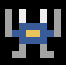
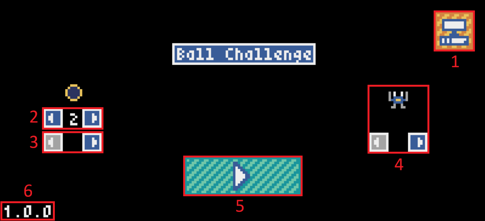
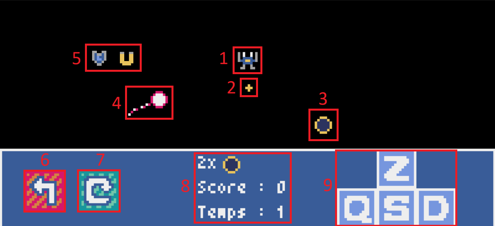
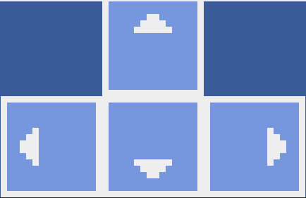

# Jouer

[Clique ici](https://osiris-sio.itch.io/ball-challenge) pour jouer sur le navigateur, que vous soyez sur PC ou Smartphone !

# Description

Plongez dans l'action avec _Ball Challenge_, un jeu d'arcade addictif où votre agilité est mise à l'épreuve ! Évitez habilement les balles rebondissantes tout en collectant autant de pièces que possible. Affrontez vos propres records et défiez vos amis pour voir qui peut atteindre le plus haut score !

# Caractéristiques

 

- **🏐 Esquivez les balles** : Utilisez vos réflexes pour éviter les balles classiques et les nouvelles **balles "Sniper"** qui vous traquent !
- **🛡️ Défense & Bonus** : Récupérez des power-ups stratégiques comme le **Bouclier** (protection + immunité) ou l'**Aimant** pour attirer les pièces.
- **🪙 Collectez des pièces** : Ramassez le plus de pièces pour accumuler des points et faire apparaître des bonus.
- **💥 Défie-vous** : Testez vos compétences jusqu'à **5 balles simultanées** pour un défi extrême.
- **👾 Graphismes rétro** : Plongez dans une esthétique rétro avec des visuels charmants.
- **🕹️ Facile à jouer, difficile à maîtriser** : Accessible à tous, mais assez difficile pour défier même les joueurs les plus expérimentés.

# Menu

1. Changer la plateforme. Permet de désactiver l'affichage de la souris et de prendre en charge le tactile.
   En mode PC, les touches ZQSD et la croix directionnelle d'une manette sont prises en compte.
2. Changer le nombre de balles pendant la partie. (**Jusqu'à 5 balles !**)
3. Changer la couleur de la balle ou des balles (15 couleurs)
4. Changer le personnage (12 personnages)
5. Bouton pour lancer une partie.
6. La version du jeu.

# Partie

1. **Votre personnage** : 8x8 pixels
2. **Une pièce** : Indispensable pour augmenter le score.
3. **Balle classique** : Rebondit sur les murs et doit être évitée.
4. **Balle Sniper** : S'arrête pour charger son tir avant de foncer droit sur vous !
5. **Les Power-ups** (Apparaissent toutes les 10 secondes) :
   - 🛡️ **Bouclier** : Protège d'un coup et rend invincible 2 secondes après un coup reçu.
   - 🧲 **Aimant** : Attire les pièces vers vous pendant 5 secondes.
6. **Bouton Menu** : Pour quitter la partie et revenir à l'écran d'accueil.
7. **Bouton Rejouer** : Pour relancer instantanément une nouvelle partie.
8. **Infos de jeu** : Affiche le nombre de balles, votre score et le temps survécu.
9. **Touches de contrôle** : Rappel des touches utilisées (ZQSD ou croix tactile).

_Remarque :_

Pour le mode "Smartphone", l'indication des touches changera en une croix directionnelle tactile.

# Pour en savoir plus :

[Site Officiel 🌍](https://osiris-sio.fr)

---

Par AMEDRO Louis (alias Osiris Sio)

Studio : Osiris Games

licence CC BY SA
